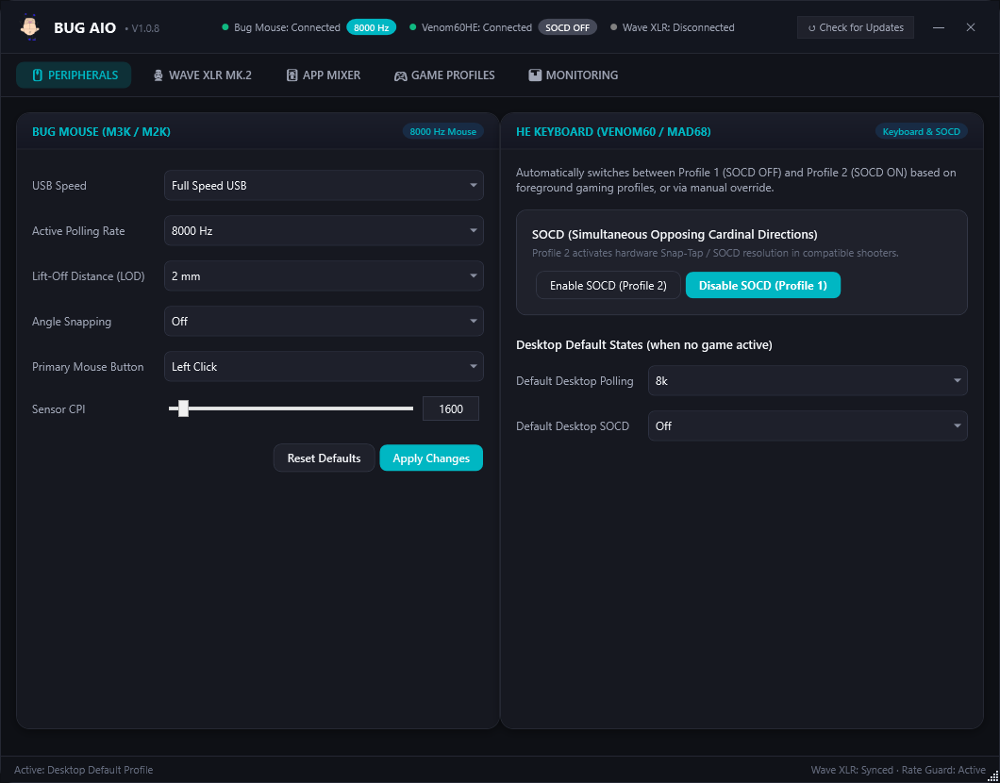
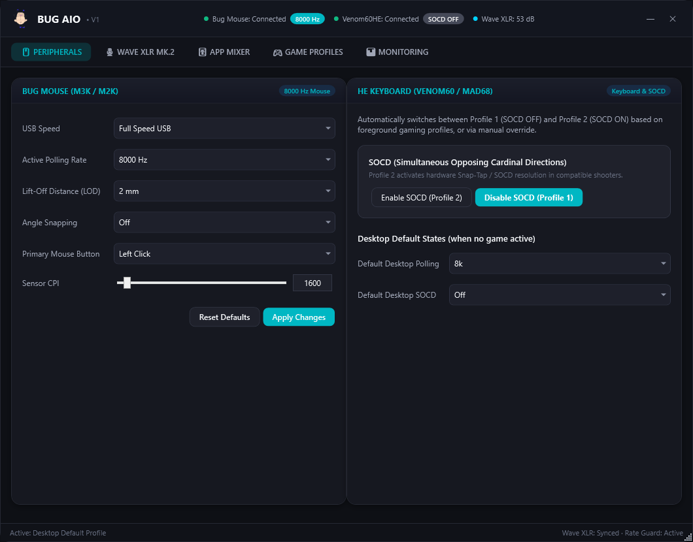
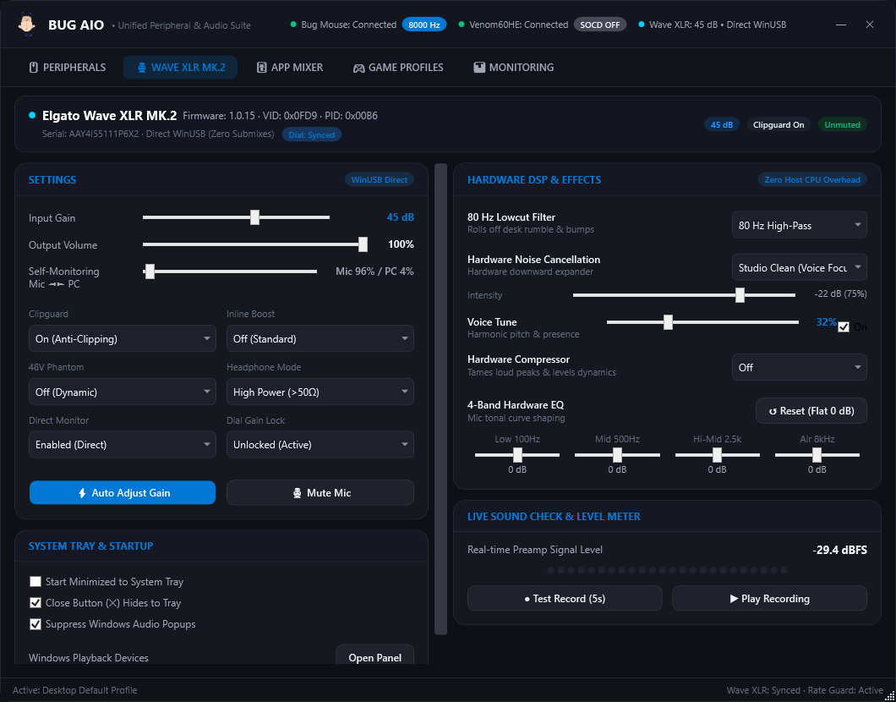
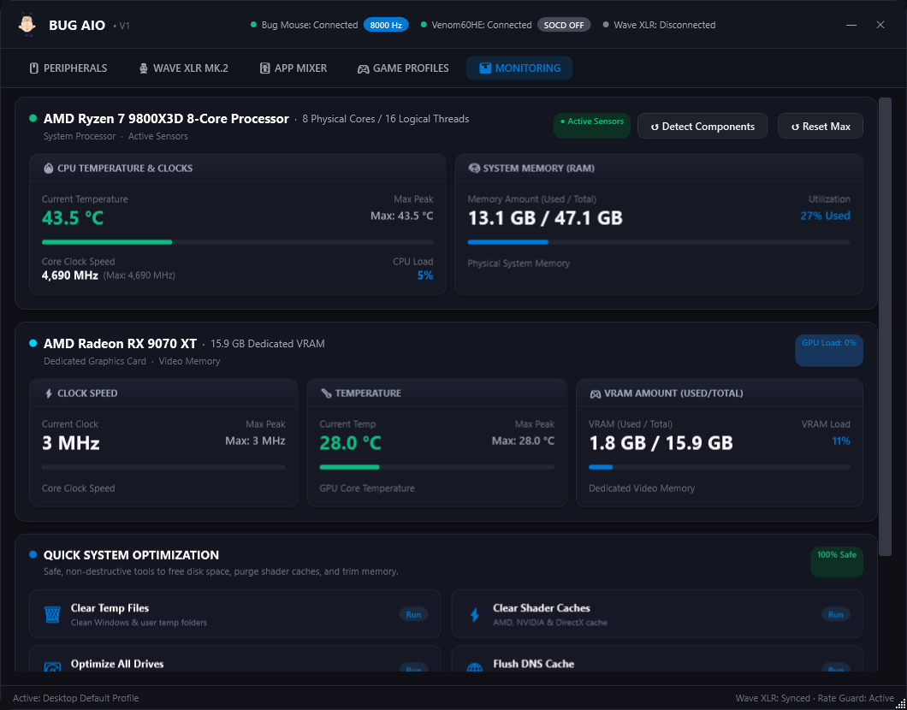

# BUG AIO

**High-Performance Unified Peripheral Controller, Studio Audio Interface & Low-Latency System Engine**

[](https://github.com/BenjyEX3/BugAIO/releases)
[-0078D6.svg?style=flat-square)](https://github.com/BenjyEX3/BugAIO)
[](https://github.com/BenjyEX3/BugAIO)
[-brightgreen.svg?style=flat-square)](https://github.com/BenjyEX3/BugAIO)
[](https://github.com/BenjyEX3/BugAIO)
[](#closed-source-model--rationale)

---

## Overview

**BUG AIO** is an ultra-lightweight, native Windows hardware orchestrator and performance suite engineered specifically for competitive gamers, audio enthusiasts, and power users.

Modern gaming setups often require running 4 to 7 separate background applications—ranging from proprietary peripheral suites (Razer Synapse, Elgato Wave Link, Logitech G HUB, Wootility) to audio mixers, hardware monitors, and game boosters. These applications are predominantly built on Chromium/Electron runtimes or heavy .NET bundles, consuming hundreds of megabytes of RAM, creating DPC latency spikes, and introducing input lag.

BUG AIO consolidates all peripheral control, studio audio DSP routing, per-application audio mixing, game-aware profile automation, low-overhead hardware telemetry, and operating system latency optimizations into a **single, standalone 270 KB native executable with zero external runtime dependencies and 0% idle CPU overhead**.



---

## Core Architectural Principles

- **Zero-Dependency Native Architecture**: Built in native C# targeting the built-in Windows .NET runtime. It requires no installers, no runtimes, no Node.js/Electron layers, and zero external DLLs.
- **DPC Latency & Interrupt Priority**: Operates at `ProcessPriorityClass.BelowNormal` during execution to guarantee that background polling never contends with game render threads, GPU scheduling, or USB interrupt service routines (ISRs).
- **Direct Hardware Communication**: Connects directly to hardware controllers via native Win32 `winusb.dll`, `hid.dll`, and Windows CoreAudio COM interfaces—completely bypassing third-party background daemons.
- **Anti-Cheat Safe Introspection**: Implements 100% non-invasive process detection using restricted Win32 tokens (`PROCESS_QUERY_LIMITED_INFORMATION`). It performs zero memory reading, zero code injection, and zero API hooking, remaining fully compliant with Vanguard, Easy Anti-Cheat, BattlEye, and Ricochet.

---

## Architecture & Protocols Used

BUG AIO interfaces with hardware, operating system subsystems, and third-party services using low-level industry protocols and direct Win32 APIs:

```
+-----------------------------------------------------------------------------------+
|                                      BUG AIO                                      |
+-----------------------------------------------------------------------------------+
       |                  |                    |                  |          |
       | WinUSB           | Raw USB HID        | WASAPI COM       | IPC      | Win32
       | Direct Control   | Feature/Output     | Unmanaged        | Named    | Low-Level
       v                  v                    v                  v          v
+---------------+  +---------------+  +----------------+  +-----------+  +----------+
|  Elgato Wave  |  |  8K Mice &    |  | Per-App Audio  |  |  Discord  |  | Memory,  |
|  XLR MK.2     |  |  Hall Effect  |  | Sessions &     |  |  Client   |  | Temp &   |
|  Audio Bridge |  |  Keyboards    |  | Peak Metering  |  |  RPC Pipe |  | Services |
+---------------+  +---------------+  +----------------+  +-----------+  +----------+
```

### 1. WinUSB Direct Interface (Elgato Wave XLR MK.2)
- **Driver Layer**: Communicates directly through Windows `winusb.dll` and `setupapi.dll` using device interface GUID `{94DC254F-6BFB-44D1-AECE-54CFF9FA57A5}` (Interface `MI_03`).
- **Vendor Request Control Transfers**: Executes synchronous USB setup packets (`WINUSB_SETUP_PACKET`) to manipulate hardware DSP state:
  - `RequestType: 0xC1` (Device-to-Host Vendor Interface) / `0x41` (Host-to-Device Vendor Interface)
  - `Request: 0x01`
  - **Block `0x0004` (Input Channel & DSP Registers)**: 38-byte hardware payload managing analog pre-gain (0–75 dB), 48V phantom power rails, 80 Hz high-pass analog filter, hardware noise cancellation/expander, ClipGuard anti-distortion limiter, Voice Tune DSP, and hardware compressor.
  - **Block `0x0005` (Headphone Amplifier Control)**: 2-byte register payload for output attenuation and analog impedance mode switching (`LowZ` <50Ω vs. High-Impedance >50Ω).
  - **Block `0x0001` (Hardware Monitor Mix)**: Crossfade balance between real-time zero-latency mic direct monitoring and host PC audio.

### 2. Raw USB HID Feature & Output Reports (Gaming Peripherals)
- **Mouse Control (STMicroelectronics High-Speed USB MCU)**:
  - Enumerates via `hid.dll` with VID `0x0483` (PID `0xA462` / `0xA3CF`).
  - Dispatches packed 16-bit hardware bitmask registers via raw HID Feature Reports (`HidD_SetFeature` / `HidD_GetFeature`).
  - Bitfield parameters: High-Speed USB mode, True 8000 Hz / 4000 Hz / 2000 Hz / 1000 Hz polling rates, 1mm / 2mm / 3mm Lift-Off Distance (LOD), angle snapping, button swapping, and raw CPI steps (50 to 20,000 CPI).
- **Hall Effect Keyboards (Venom60HE & Mad68HE / Madlions)**:
  - Vendor Usage Page `0xFF00`–`0xFF53`, Usages `0x61`, `0x62`, `0x01`.
  - Sends 64-byte raw HID output reports directly to controller endpoints to query firmware revision packets (`0xE3`), active profile registers (`0x40`), and switch hardware profiles in real time.
  - Manages instant on-the-fly SOCD (Simultaneous Opposing Cardinal Directions / Snap Tap) hardware profile selection.

### 3. Windows CoreAudio / WASAPI Unmanaged COM Interop
- Direct unmanaged COM interop without external audio libraries:
  - `IMMDeviceEnumerator` (`BCDE0395-E52F-467C-8E3D-C4579291692E`)
  - `IMMDevice` & `IPropertyStore` (`A45C254E-DF1C-4EFD-8020-67D146A850E0`)
  - `IAudioEndpointVolume` (`5CDF2C82-841E-4546-9722-0CF74078229A`)
  - `IAudioMeterInformation` (`C02216F6-8C67-4B5B-9D00-D008E73E0064`)
  - `IAudioSessionManager2` (`77AA99A0-1BD6-484F-8BC7-2C654C9A9B6F`)
  - `IAudioSessionEnumerator` & `IAudioSessionControl2` (`BFB7FF88-7239-4FC9-8FA2-07C950BE9C6D`)
  - `ISimpleAudioVolume` (`87CE5498-68D6-44E5-9215-6DA47EF883D8`)
- Real-time hardware volume change callback sink (`IAudioEndpointVolumeCallback`) enables active dial-gain enforcement.
- Per-application audio stream enumeration and individual session volume attenuation.

### 4. IPC & Telemetry Protocols
- **Discord Rich Presence Wire Protocol**:
  - Implements the raw Discord IPC client over Windows Named Pipes (`\\.\pipe\discord-ipc-0` through `\\.\pipe\discord-ipc-9`).
  - Direct 8-byte framed protocol header `[Opcode: uint32][Length: uint32]` carrying raw JSON payloads (`OP_HANDSHAKE`, `OP_FRAME`) without relying on the official Discord GameSDK or native binary wrappers.
- **Kernel-Level Hardware Telemetry (RivaTuner / MSI Afterburner IPC)**:
  - Consumes the `MAHMSharedMemory` memory-mapped file structure (`MAHM_SHARED_MEMORY_HEADER`, `MAHM_SHARED_MEMORY_ENTRY`) for true zero-overhead reading of GPU/CPU temperatures, clock frequencies, usage percentages, and VRAM utilization directly from kernel-mode driver hooks.
  - Fallback introspection via `GlobalMemoryStatusEx` and Win32 WMI.

---

## Detailed Feature Matrix

### Peripherals Engine
- **8000 Hz Mouse Control**: Instantaneous hardware switching between 8000 Hz, 4000 Hz, 2000 Hz, and 1000 Hz polling rates.
- **Sensor Calibration**: Real-time CPI adjustment from 50 to 20,000 CPI in 50 CPI steps, hardware lift-off distance (1mm, 2mm, 3mm), and angle snapping toggle.
- **Magnetic Switch / Hall Effect Keyboard Automation**: Full integration for Venom60HE and Mad68HE magnetic switch keyboards.
- **Hardware SOCD Control**: Toggle Simultaneous Opposing Cardinal Directions (Snap Tap / Rappy Snappy) directly on the keyboard controller, with instant desktop/game profile switching.



### Elgato Wave XLR MK.2 Hardware Studio Bridge
- **Zero-Bloat Hardware Control**: Complete control over the Wave XLR MK.2 without installing or running Elgato Wave Link.
- **Dial Gain Lock**: Actively monitors physical knob events. If the physical dial is bumped or rotated during gameplay, BUG AIO intercepts the event and locks the gain back to the configured decibel target within milliseconds.
- **Hardware DSP Configuration**:
  - Analog preamp gain adjustment from 0 dB to 75 dB.
  - Hardware ClipGuard dual-stage analog limiter toggle.
  - 48V Phantom Power state control.
  - 80 Hz Low-cut high-pass hardware filter.
  - Headphone output volume, mute status, and impedance staging (<50Ω vs >50Ω).
  - Hardware Crossfade balance (Mic direct monitoring vs PC audio playback).
  - 4-Band hardware digital EQ (100 Hz, 500 Hz, 2.5 kHz, 8 kHz).
  - Hardware Noise Cancellation / Voice Focus expander and Voice Tune processing.
- **Live Metering & Sound Check**: Real-time dBFS peak metering and an integrated test recorder/playback system utilizing Windows MCI.



### Native Per-App Audio Mixer
- Replaces the Windows Volume Mixer with a fast, responsive interface.
- Enumerates active WASAPI audio sessions, extracting application icons and process identifiers.
- Independent volume control sliders and mute toggles per application.
- Remembers per-application volume levels across system reboots via `config.json`.

### Game Profile Automation
- **Foreground Process Watcher**: Actively scans active applications at 400ms intervals using passive Win32 tokens.
- **Automatic Per-Game Profiles**: Automatically switches peripheral profiles upon game launch:
  - Drops polling rate to 1000 Hz in game engines sensitive to high report rates (e.g. *Rust*).
  - Engages 8000 Hz polling rate and hardware SOCD in supported competitive titles (*Apex Legends*, *Overwatch*).
  - Disables SOCD in tournament-restricted titles (*Counter-Strike 2*, *VALORANT*) to remain fully compliant with publisher rules.
- Automatically reverts peripherals back to default desktop settings upon alt-tabbing or exiting.

### Hardware Telemetry & System Optimization
- **Live Hardware Monitoring**: Live CPU and GPU clock speeds, operating temperatures, RAM utilization, VRAM allocation, and utilization percentages. Includes a sensor pause toggle to eliminate all monitoring cycles during competitive matches.
- **System Latency Optimizer**:
  - **Power Scheme**: Activates the Windows High / Ultimate Performance power plan.
  - **Working Set Trim**: Flushes unused process working sets via `EmptyWorkingSet` and forces generational garbage collection.
  - **Shader Cache Flush**: Cleans NVIDIA (`DXCache`, `GLCache`, `ComputeCache`), AMD (`DxCache`, `GLCache`), and DirectX shader caches to resolve stuttering.
  - **Network Buffer Refresh**: Flushes the Windows DNS resolver cache directly via `DnsFlushResolverCache`.
  - **Service Pruning**: Safely halts non-essential background telemetry and print/map services (`DiagTrack`, `SysMain`, `Spooler`, `WerSvc`, `MapsBroker`).
  - **Drive Maintenance**: Initiates silent background volume TRIM and defragmentation (`defrag /C /O`).



### Discord Rich Presence
- Native lightweight RPC integration reporting active game profiles and suite status.
- Configurable Client ID and custom presence states.

---

## Hardware & Protocol Specifications

| Device / Subsystem | Identifier (VID / PID) | Protocol / Transport | Endpoints / Commands |
|:---|:---|:---|:---|
| **Elgato Wave XLR MK.2** | `VID: 0x0FD9`<br>`PID: 0x00B6` | WinUSB Direct Control<br>CoreAudio WASAPI | Interface `MI_03`<br>Vendor Blocks `0x0004`, `0x0005`, `0x0001`<br>`IAudioEndpointVolume` Callback Sink |
| **STMicroelectronics 8K Mouse** | `VID: 0x0483`<br>`PID: 0xA462` / `0xA3CF` | USB HID Feature Reports | Packed 16-bit register payload<br>Feature Report (Length >= 5 bytes) |
| **Venom60HE Keyboard** | `VID: 0x534B`<br>`PID: 0x3104` | USB HID Output / Input Reports | UsagePage `0xFF53`, Usage `0x61`/`0x62`<br>Commands: `0xE3` (FW), `0x40` (Profile) |
| **Mad68HE Keyboard** | `VID: 0x373B` / `0x3710` | USB HID Output / Input Reports | UsagePage `0xFF00`, Usage `0x61`/`0x01`<br>64-byte structured packets |
| **WASAPI Audio Engine** | System Audio Endpoint | Windows COM / CoreAudio | `IAudioSessionManager2`, `IAudioMeterInformation` |
| **Hardware Telemetry** | RivaTuner / MSI Afterburner | Win32 Memory-Mapped File | File: `MAHMSharedMemory` (`0x4D48414D`) |
| **Discord RPC** | Local Named Pipe | Local IPC Named Pipe | `\\.\pipe\discord-ipc-[0-9]` (Framed JSON) |

---

## Architectural Comparison

| Metric / Capability | BUG AIO | Vendor Suites (Wave Link, Synapse, G HUB) |
|:---|:---|:---|
| **Distribution Footprint** | **270 KB** (Single Standalone Executable) | 350 MB – 1.2 GB (Multiple Installers) |
| **Runtime Architecture** | Native C# / Pure Win32 P/Invoke | Electron / Chromium / Node.js / Heavy .NET |
| **Idle Memory Consumption** | **< 15 MB** | 400 MB – 1.5 GB combined |
| **Background CPU Usage** | **0.0%** (BelowNormal priority) | 1.5% – 6.0% (Periodic spikes) |
| **External Background Services** | **0** | 4 to 12 background services & daemons |
| **Anti-Cheat Interference Risk** | **None** (Passive `PROCESS_QUERY_LIMITED_INFORMATION`) | Occasional hook collisions & overlay flags |
| **Hardware Dial Lock** | **Yes** (Active volume callback enforcement) | No |
| **Cross-Device Profile Sync** | **Unified** (Mouse + Keyboard + Audio in one trigger) | Fragmented across individual apps |

---

## Closed Source Model & Rationale

BUG AIO is maintained as a proprietary, closed-source project. This model was chosen deliberately to protect both the end user and the integrity of the software:

### 1. Competitive Anti-Cheat Integrity
BUG AIO automates hardware profiles, polling rates, and keyboard SOCD states based on foreground process detection. Anti-cheat engines (Riot Vanguard, Easy Anti-Cheat, BattlEye, Valve Anti-Cheat) maintain strict heuristics regarding software interacting with system processes and input hardware. 

Open-sourcing low-level process detection code and raw HID communication interfaces creates an immediate risk: malicious actors can fork and weaponize the repository to build unauthorized macros or cheat injection tools. Once a codebase signature is abused by third-party forks, anti-cheat vendors frequently blacklist or flag the underlying execution patterns, which would jeopardize legitimate players. Keeping the binary proprietary preserves strict cryptographic integrity, guarantees consistent hashes, and prevents binary abuse.

### 2. Peripheral Firmware & Hardware Protection
BUG AIO issues raw vendor-specific WinUSB control transfers and direct USB HID feature reports directly to device microcontrollers and EEPROM storage (such as the Elgato Wave XLR, custom 8K mouse MCUs, and Hall Effect keyboards). Writing invalid bitmasks or ill-formed byte packets to hardware registers can corrupt device calibration tables or permanently brick peripheral controllers. A closed codebase ensures that all low-level hardware routines remain rigorously tested, verified, and safe from unauthorized or unstable modifications.

### 3. Absolute Binary Authenticity & Zero-Bloat Guarantee
A core promise of BUG AIO is delivering a zero-compromise, standalone, clean utility with no telemetry, no tracking, and no bundled software. By maintaining official closed releases under the verified repository (`BenjyEX3/BugAIO`), users are protected against malicious repackages, trojanized builds, and ad-supported distribution sites.

### 4. Protection of Proprietary Reverse-Engineering
Significant research was invested into reverse-engineering undocumented vendor hardware control blocks (specifically Elgato Wave XLR MK.2 WinUSB interface packets, Hall Effect keyboard command protocols, and ultra-lightweight RTSS memory maps). Maintaining proprietary ownership ensures the continuity and quality of this engineering effort.

---

## Installation & Deployment

BUG AIO requires no installation procedure and writes no temporary files outside its own working directory:

1. Download the latest compiled executable from the official [Releases](https://github.com/BenjyEX3/BugAIO/releases) page:
   ```
   Bug AIO.exe
   ```
2. Place `Bug AIO.exe` into any preferred directory (e.g. `C:\Program Files\Bug AIO\` or your user tools directory).
3. Run the executable. On first launch, BUG AIO automatically generates a localized `config.json` in the application directory.
4. *(Optional)* Enable **Start with Windows** and **Start Minimized** in the application settings to run the suite quietly in the system tray.

### Command-Line Arguments

BUG AIO supports operational command-line flags for automation and headless invocation:

```bash
# Launch minimized directly to the system tray
"Bug AIO.exe" --minimized

# Launch directly into a specific view (0: Peripherals, 1: Wave XLR, 2: App Mixer, 3: Games, 4: Monitoring)
"Bug AIO.exe" --tab 1

# Execute a silent update check against the GitHub API and exit
"Bug AIO.exe" --test-update
```

---

## Configuration Specification

All preferences, audio volumes, and game profiles are stored locally in human-readable JSON format within `config.json`:

```json
{
  "perGameEnabled": true,
  "startWithWindows": false,
  "startMinimized": false,
  "closeToTray": true,
  "suppressAudioPopups": true,
  "defaultPollingRate": "8k",
  "defaultSocd": "Off",
  "discordRpcEnabled": true,
  "discordClientId": "383226320970055681",
  "monitoringPaused": false,
  "mouseUsbSpeed": 1,
  "mousePollingRate": 0,
  "mouseLod": 1,
  "mouseAngleSnapping": 0,
  "mousePrimaryButton": 0,
  "mouseCpi": 1600,
  "waveXlrGain": 47,
  "waveXlrOutputVol": 100,
  "waveXlrCrossfade": 8,
  "waveXlrClipguard": true,
  "waveXlrInlineBoost": "Off (Standard)",
  "waveXlrPhantom48V": false,
  "waveXlrHeadphoneMode": "Standard (<50Ω)",
  "waveXlrDirectMonitor": true,
  "waveXlrDialGainLock": true,
  "waveXlrMuted": false,
  "waveXlrLowcut": "80 Hz High-Pass",
  "waveXlrNoiseCancelMode": "Studio Clean (Voice Focus)",
  "waveXlrNoiseCancelIntensity": 75,
  "waveXlrVoiceTuneEnabled": true,
  "waveXlrVoiceTuneIntensity": 32,
  "waveXlrCompressorMode": "Off",
  "appVolumes": {
    "spotify.exe": 100,
    "discord.exe": 90,
    "steam.exe": 100
  },
  "games": [
    {
      "exeName": "RustClient.exe",
      "path": "C:\\Program Files (x86)\\Steam\\steamapps\\common\\Rust\\RustClient.exe",
      "pollingRate": "1k",
      "socd": "On"
    },
    {
      "exeName": "cs2.exe",
      "path": "C:\\Program Files (x86)\\Steam\\steamapps\\common\\Counter-Strike Global Offensive\\game\\bin\\win64\\cs2.exe",
      "pollingRate": "8k",
      "socd": "Off"
    }
  ]
}
```

---

## System Requirements

- **Operating System**: Microsoft Windows 10 (64-bit) or Windows 11 (64-bit).
- **Runtime**: Built-in Microsoft .NET Framework 4.5+ (pre-installed on all modern Windows installations).
- **Hardware Prerequisites**:
  - Available USB ports for target peripherals.
  - Elgato Wave XLR MK.2 (for studio interface module).
  - STMicroelectronics 8K MCU compatible mouse (for 8K mouse module).
  - Venom60HE or Mad68HE magnetic switch keyboard (for SOCD / profile module).
  - *(Optional)* RivaTuner Statistics Server (RTSS) / MSI Afterburner for kernel-level GPU/CPU telemetry.

---

## Technical Support & Verification

- **Repository**: [github.com/BenjyEX3/BugAIO](https://github.com/BenjyEX3/BugAIO)
- **Author**: BenjyEX3
- **Integrity Verification**: Official binary releases are signed and checksummed in release notes. Verify SHA256 hashes prior to deployment.
